# Pelosi 股票/ETF 交易分析报告

> 生成时间: 2026-06-02 21:50 · House STOCK Act PTR · 2023-03-09 起

## 数据范围

- **分析区间**: 2023-03-09 → 2026-01-16（交易发生日）
- **House PTR 文件数**: 15 份（有效 15）
- **披露日**: 2023-04-06, 2023-06-22, 2023-12-21, 2024-02-23, 2024-07-02, 2024-07-30, 2025-01-17, 2025-07-09, 2026-01-23
- **有 ticker（可交易）**: **33**（**13** 只 ticker）
- **可算 NW 收益（有 `amount_min`）**: **23**（另有 **10** 笔因金额缺失未进入 horizon 表）
- **股票/ETF 名义下限合计**: **$22.9M**（PTR `amount_min` 求和，仅有金额行）
- **全部解析行**: **35**（含债券等；全文件名义合计约 **$23.4M**）
- **PDF 行→解析覆盖率**: **92.2%** · 解析行含金额比例 **66.0%**


**买卖结构（股票 + 期权原始行；买入含 `exercise`；名义：股票=PTR 下限，期权=张数×100×行权价或 PTR 下限）**

| 类别 | 笔数 | 名义合计 | 占名义比例 |
|------|-----:|---------:|-----------:|
| 股票买入 | 14 | $6.7M | 20.9% |
| 股票卖出 | 11 | $16.8M | 52.6% |
| 期权买入/行权 | 14 | $8.5M | 26.5% |
| 期权卖出 | 0 | — | 0.0% |
| **合计** | **39** | **$31.9M** | 100% |

**Horizon PnL 样本（合并账；锚点=交易发生日；期权名义=张数×100×标的锚点价）**

| 口径 | 笔数 | 经济名义合计 |
|------|-----:|-------------:|
| 股票 | 23 | $22.9M |
| 期权 | 14 | $21.6M |
| 合计 | 37 | $44.5M |

| 方向 | 股票 PnL 名义 | 期权 PnL 名义 |
|------|-------------:|----------------:|
| 买入 | $6.2M | $21.6M |
| 卖出 | $16.8M | — |

> 卖出行在 horizon 表按 **sign=−1** 跟单；不等于认定做空。


## 名义与口径（读表前必读）

本报告并行使用 **三套名义** 与 **两套 FIFO / MTM**，请勿混读数字：

| 名义类型 | 定义 | 用于 |
|----------|------|------|
| **PTR 下限** `amount_min` | House 披露区间下限 | 原始表合计、仅股票 FIFO、`portfolio_daily` |
| **经济名义** `economic_notional` | 股票=PTR 下限；期权=张数×100×**交易日标的收盘价** | Horizon NW、统一 FIFO、`unified_portfolio_daily` |
| **Strike 名义**（图表回退） | 张数×100×行权价 | 无现货价时；主图 **04** 已优先经济名义 |

| 模块 | 队列 | 本样本要点 |
|------|------|------------|
| **Horizon timing** | 无 FIFO；每笔独立事件 | 合并账 **37** 笔（股票 **23** + 期权 **14**） |
| **股票 FIFO** | ticker；仅 purchase/sale | 已实现用 `min(买,卖) amount_min`，**≠** horizon |
| **统一 FIFO** | purchase/exercise 入、sale 出 | `open_holdings_top10.csv` 基于统一队列 |
| **`portfolio_daily`** | 仅股票 FIFO + PTR | 与统一 MTM 可能差一个数量级 |

- **金额缺失**：仍有 **10** 笔股票无 `amount_min`，不进 NW 表（期权可无 PTR 金额仍靠张数×价计价）。
- **合并账**：同一标的上股票与期权/行权各算一笔独立 timing PnL，**未**去重净敞口。


<figure class="report-fig">
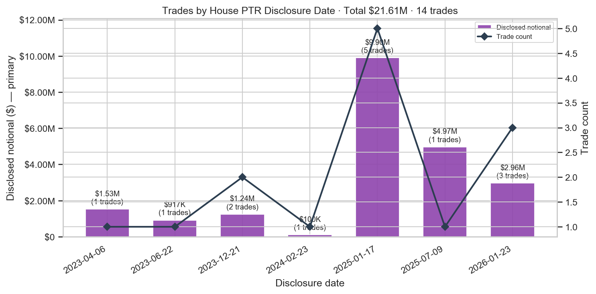
<figcaption>披露日批次：披露名义总额 + 笔数</figcaption>
</figure>


<figure class="report-fig">
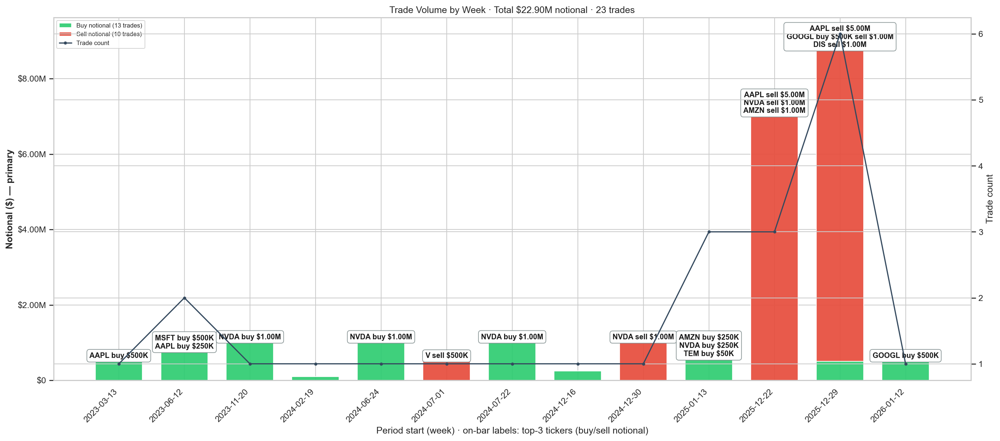
<figcaption>交易时间线（按日/周）：名义金额为主；柱顶标注 Top3 公司 buy/sell 名义</figcaption>
</figure>


<figure class="report-fig">
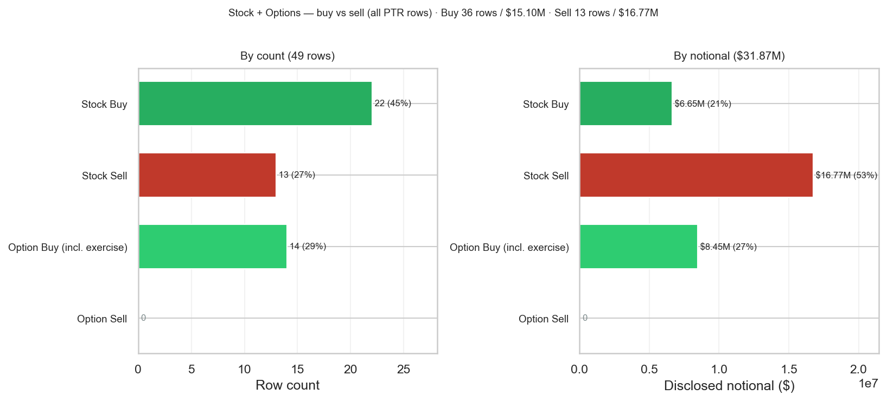
<figcaption>股票/期权 买·卖 四项 — 笔数与经济名义（交易日标的收盘价×张数×100）</figcaption>
</figure>


## Pelosi 当前净多头持仓（Top 10）

基于 **统一 FIFO**（股票+期权/行权入队）未配对 lot（`match_status=open`），按 horizon **经济名义** 合计排序。
Horizon 收益以 **最早一笔未平买入** 的 anchor 日计（合并账用 `combined_timing`）。
截至分析截止日仍标注 **仍持有**；仅股票 FIFO 对照见 `open_holdings_top10_stock_fifo.csv`。

> **净名义不是精确市值**：House PTR 只披露区间（如 **$500,001–$1,000,000**），本表用区间**下限** `amount_min` 相加，故常见 **$500,001、$1,000,002**（两笔各下限 $500,001）等「多 $1」——这是 STOCK Act 档位设计，不是程序多加 1 美元。

| Ticker | 净名义($) | 未平 lot | 来源 | 最早买入 | 持有天 | 状态 | +1d | +5d | +10d | +20d | +30d |
|--------|----------:|---------:|------|----------|------:|------|-----:|-----:|------:|------:|------:|
| NVDA | 9,413,897 | 6 | stock | 2024-07-26 | 673 | 仍持有 | -1.30% | -5.12% | -7.35% | 14.43% | -5.83% |
| PANW | 2,814,922 | 3 | stock | 2024-02-21 | 829 | 仍持有 | 2.23% | 20.68% | 6.45% | 7.66% | 1.23% |
| AMZN | 1,445,601 | 2 | stock | 2025-01-14 | 501 | 仍持有 | 2.57% | 7.92% | 8.87% | 5.13% | -4.14% |
| AAPL | 1,167,193 | 2 | option | 2023-06-15 | 1080 | 仍持有 | -0.59% | 0.36% | 4.28% | 4.29% | 5.61% |
| VST | 831,865 | 1 | option | 2026-01-16 | 134 | 仍持有 | -5.88% | -4.68% | -7.41% | 4.25% | -2.94% |
| MSFT | 500,001 | 1 | stock | 2023-06-15 | 1080 | 仍持有 | -1.66% | -3.76% | -2.17% | -0.68% | -3.50% |
| GOOGL | 500,001 | 1 | stock | 2026-01-16 | 134 | 仍持有 | -2.42% | 0.99% | 4.15% | -8.48% | -8.01% |
| TEM | 100,002 | 2 | option | 2025-01-14 | 501 | 仍持有 | 9.71% | 58.50% | 59.50% | 132.11% | 73.74% |


<figure class="report-fig">
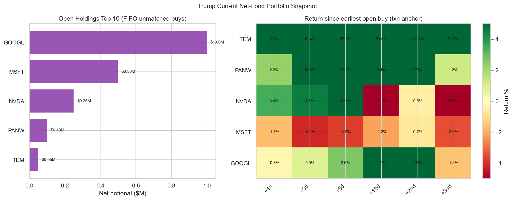
<figcaption>当前净多头 Top10：名义 + 买入后 horizon 收益</figcaption>
</figure>


## Pelosi 组合持仓与 PnL 时间序列

按 **FIFO 净多头** 重建每个交易日的 EOD 持仓：
- **持仓规模**：未平仓买入的 PTR 名义合计（成本）及按收盘价 mark-to-market 的市值；
- **口径**：仅股票 FIFO + PTR amount_min；期权/行权敞口见 unified_portfolio_daily
- **每日 PnL**：各仍持有标的的日度价格变动 × 对应名义仓位，卖出日记入已实现收益；
- **累计 PnL**：全部交易日 daily PnL 的 running sum（整组合曲线）。

- 样本交易日: **778** 天
- 截止 **2026-04-23**：MTM 持仓 **$2.1M**，累计 PnL **$3.9M**
- 持仓 MTM 峰值: **$7.4M**（2024-12-24）

明细: `reports/portfolio_daily.csv`


<figure class="report-fig">
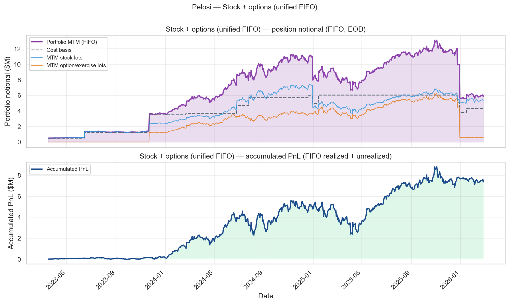
<figcaption>组合持仓规模与累计 PnL 随时间变化（仅股票 FIFO 日度）</figcaption>
</figure>


<figure class="report-fig">
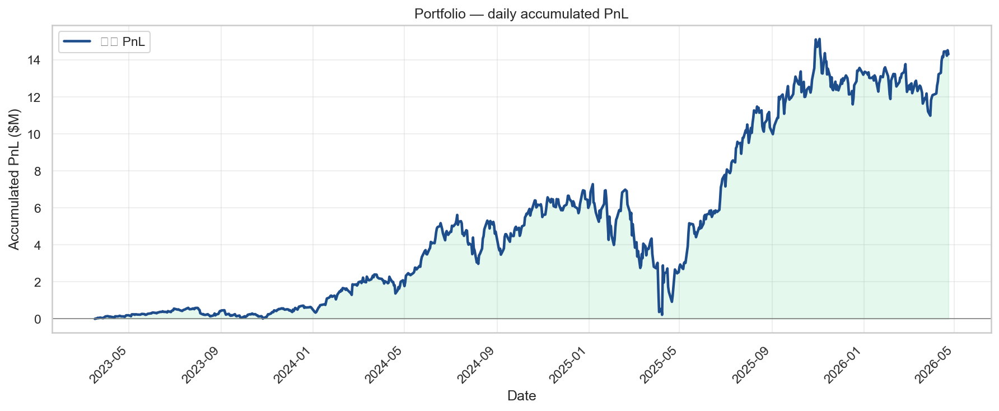
<figcaption>每个交易日累计 PnL（FIFO 盯市，直至分析截止日）</figcaption>
</figure>


<figure class="report-fig">
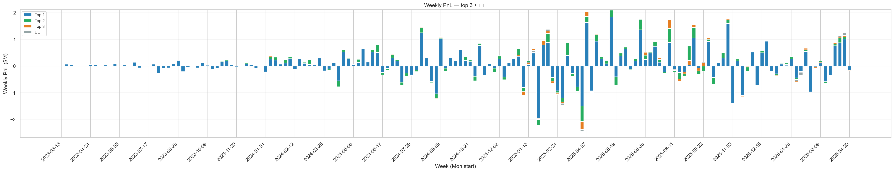
<figcaption>每周 PnL：当周 |PnL| 前三股票 + 其他（堆叠柱）</figcaption>
</figure>


## 统一 FIFO 组合（股票 + 期权/行权，按标的）

同一 **underlying ticker** 一条 FIFO 队列：
- **入队**：股票 `purchase`、期权 `purchase`（按 张数×100×标的价 计名义）、`exercise`（行权交付股份）；
- **出队**：股票 `sale`、期权 `sale`；
- 这样 NVDA/AAPL 等「先买 call / 行权、后卖股」可与后续 **sell** 配对，减少 `prior_position` 孤儿卖单。

- FIFO 配对: **9** 对（其中买入来自期权/行权: **5**，来自股票: **4**）
- 仍无买入匹配的卖出: **3** 笔
- 未平仓 lot: **18**
- 截止 **2026-04-23**：MTM **$30.1M**，累计 PnL **$14.3M**

明细: `reports/unified_matched_lots.csv`，`reports/unified_portfolio_daily.csv`


<figure class="report-fig">
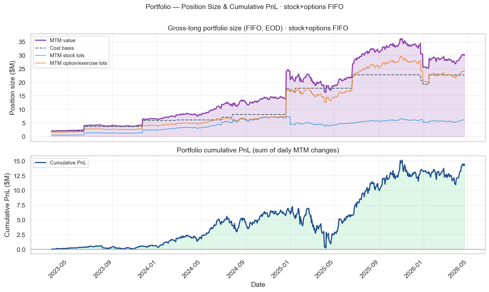
<figcaption>统一 FIFO（股票+期权/行权）：仓位与累计 PnL 随时间</figcaption>
</figure>


## Cross-Check

- House Clerk 官方 PTR: ✅
- PTR PDF 校验: ✅

### 已纳入文件（逐份统计）

名义金额 = 各笔 PTR 披露区间**下限**（`amount_min`）相加。

| doc_id | 页数 | 披露日 | 解析笔数 | 股票/ETF笔数 | ticker数 | 股票名义($) | 全文件名义($) | 内容 |
|--------|-----:|--------|--------:|-------------:|---------:|------------:|--------------:|------|
| pelosi_ptr_20022260 | 3 | 2023-01-12 | 0 | 0 | 0 | — | — | 市政/公司债 |
| pelosi_ptr_20022320 | 1 | 2023-01-25 | 0 | 0 | 0 | — | — | 市政/公司债 |
| pelosi_ptr_20022664 | 1 | 2023-04-06 | 2 | 1 | 1 | $500K | $1.0M | 少量股票/ETF |
| pelosi_ptr_20023080 | 1 | 2023-06-06 | 0 | 0 | 0 | — | — | 市政/公司债 |
| pelosi_ptr_20023192 | 1 | 2023-06-22 | 2 | 2 | 2 | $750K | $750K | 少量股票/ETF |
| pelosi_ptr_20024186 | 1 | 2023-12-21 | 1 | 1 | 1 | $1.0M | $1.0M | 少量股票/ETF |
| pelosi_ptr_20024542 | 1 | 2024-02-23 | 1 | 1 | 1 | $100K | $100K | 少量股票/ETF |
| pelosi_ptr_20024625 | 1 | 2024-03-21 | 0 | 0 | 0 | — | — | 市政/公司债 |
| pelosi_ptr_20025368 | 2 | 2024-07-02 | 4 | 4 | 3 | $1.5M | $1.5M | 少量股票/ETF |
| pelosi_ptr_20025535 | 1 | 2024-07-30 | 2 | 2 | 2 | $1.0M | $1.0M | 少量股票/ETF |
| pelosi_ptr_20025819 | 1 | 2024-09-11 | 0 | 0 | 0 | — | — | 市政/公司债 |
| pelosi_ptr_20026590 | 2 | 2025-01-17 | 6 | 6 | 4 | $1.8M | $1.8M | 少量股票/ETF |
| pelosi_ptr_20030630 | 1 | 2025-07-09 | 2 | 1 | 1 | — | $15K | 少量股票/ETF |
| pelosi_ptr_20033337 | 1 | 2025-10-24 | 0 | 0 | 0 | — | — | 市政/公司债 |
| pelosi_ptr_20033725 | 3 | 2026-01-23 | 15 | 15 | 8 | $16.3M | $16.3M | 少量股票/ETF |

## 样本验证

| Ticker | 动作 | 日期 | 匹配 |
|--------|------|------|------|
| AVGO | sale | 2025-06-20 | ✅ |
| NVDA | purchase | 2024-07-26 | ✅ |
| AAPL | purchase | 2023-03-17 | ✅ |

## 持仓时间（FIFO 买→卖配对）

- 成功配对: **9** 对，涉及 **5** 个 ticker
- 持仓中位: **359** 天，均值: **477** 天
- 规则: 同 ticker 按日期排序，**先进先出**；无对应买入的卖出标为 `prior_position`；未卖出买入标为 `open`
- 明细: `reports/matched_lots.csv`（每笔买-卖对），`reports/holdings_by_ticker.csv`（每 ticker 平均持仓）

### Top tickers（按 Pelosi 名义金额）

```
ticker  n_matched_pairs  n_open_buys  n_prior_sells  avg_holding_days  median_holding_days  min_holding_days  max_holding_days  pelosi_total_notional
  AAPL                2            0              0             971.0                971.0             929.0            1013.0             10750004.0
  NVDA                4            2              0             323.5                295.0             188.0             516.0              6500008.0
 GOOGL                1            2              0             350.0                350.0             350.0             350.0              2000003.0
  AMZN                1            1              0             344.0                344.0             344.0             344.0              1250002.0
  AVGO                1            0              0             359.0                359.0             359.0             359.0                    NaN
```


<figure class="report-fig">
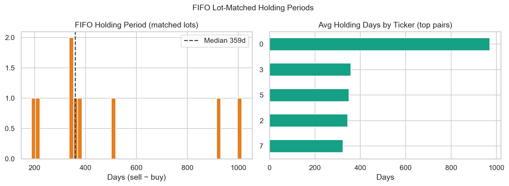
<figcaption>FIFO 持仓天数分布</figcaption>
</figure>


## 股票 + 期权合并 PnL（期权按 **100 股/张**）

Combined book: stock notional = PTR amount_min; option notional = n_contracts × 100 × underlying anchor price (fallback amount_min). Horizon return on underlying; buy/exercise +1, sale −1.

- Horizon 样本：**37** 笔（股票 **23** / 期权 **14**）
- 合约乘数：**100** 股/张

### 合并 timing（锚点 = 交易发生日）

#### 合计（股票 + 期权）

| 窗口(交易日) | 笔数 | 总名义($) | 总PnL($) | **名义加权收益率** |
|---|---:|---:|---:|---:|
| +1d | 37 | 44,514,655 | 193,933 | **0.44%** |
| +3d | 37 | 44,514,655 | 585,682 | **1.32%** |
| +5d | 37 | 44,514,655 | 841,558 | **1.89%** |
| +10d | 37 | 44,514,655 | 1,130,825 | **2.54%** |
| +20d | 37 | 44,514,655 | 2,296,382 | **5.16%** |
| +30d | 37 | 44,514,655 | 1,036,223 | **2.33%** |

#### 其中：股票

| 窗口(交易日) | 笔数 | 总名义($) | 总PnL($) | **名义加权收益率** |
|---|---:|---:|---:|---:|
| +1d | 23 | 22,900,023 | -35,807 | **-0.16%** |
| +3d | 23 | 22,900,023 | 34,273 | **0.15%** |
| +5d | 23 | 22,900,023 | 290,307 | **1.27%** |
| +10d | 23 | 22,900,023 | 455,351 | **1.99%** |
| +20d | 23 | 22,900,023 | 831,217 | **3.63%** |
| +30d | 23 | 22,900,023 | 295,749 | **1.29%** |

#### 其中：期权（标的价 × 100 股/张名义）

| 窗口(交易日) | 笔数 | 总名义($) | 总PnL($) | **名义加权收益率** |
|---|---:|---:|---:|---:|
| +1d | 14 | 21,614,632 | 229,740 | **1.06%** |
| +3d | 14 | 21,614,632 | 551,409 | **2.55%** |
| +5d | 14 | 21,614,632 | 551,251 | **2.55%** |
| +10d | 14 | 21,614,632 | 675,473 | **3.13%** |
| +20d | 14 | 21,614,632 | 1,465,165 | **6.78%** |
| +30d | 14 | 21,614,632 | 740,475 | **3.43%** |


<figure class="report-fig">
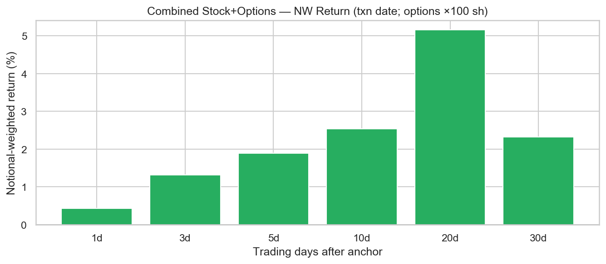
<figcaption>股票+期权合并：名义加权 horizon 收益（期权按 100 股/张）</figcaption>
</figure>


<figure class="report-fig">
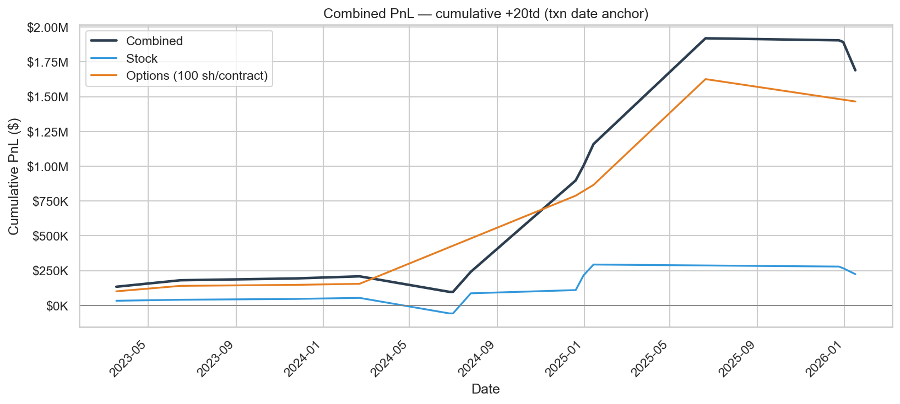
<figcaption>股票+期权合并：累计 PnL（合计 vs 股票 vs 期权）</figcaption>
</figure>

明细: `data/processed/combined_timing_returns.parquet`，`reports/combined_timing_stock_summary.csv`，`reports/combined_timing_option_summary.csv`


## 1. Pelosi 自身交易 timing（锚点 = **交易发生日**）

- **Horizon 收益**：交易发生日为锚点；**买入 sign=+1**，**卖出 sign=−1**（披露方向跟单，用于观察卖后价格走势，**非**认定真实做空）。
- **已实现持仓**：FIFO **买→卖** 配对见 §1d；可与 §期权与套利 对照。
- notional = PTR `amount_min`；窗口: **1, 3, 5, 10, 20, 30** 个交易日

### 1a. 合计（买 + 卖，卖按 sign=−1）

| 窗口(交易日) | 笔数 | 总名义($) | 总PnL($) | **名义加权收益率** |
|---|---:|---:|---:|---:|
| +1d | 23 | 22,900,023 | -35,807 | **-0.16%** |
| +3d | 23 | 22,900,023 | 34,273 | **0.15%** |
| +5d | 23 | 22,900,023 | 290,307 | **1.27%** |
| +10d | 23 | 22,900,023 | 455,351 | **1.99%** |
| +20d | 23 | 22,900,023 | 831,217 | **3.63%** |
| +30d | 23 | 22,900,023 | 295,749 | **1.29%** |


<figure class="report-fig">
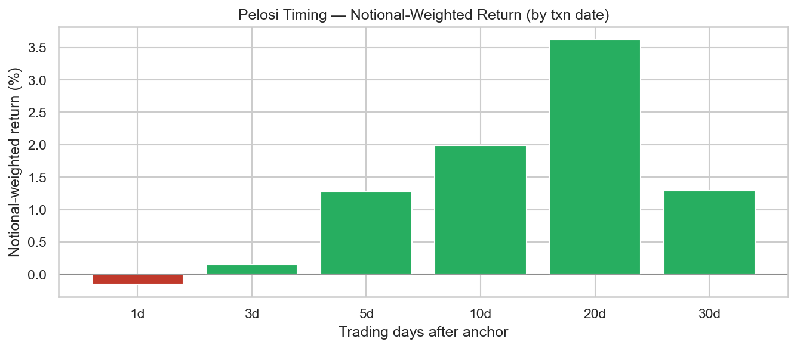
<figcaption>Pelosi timing：名义加权 horizon 收益</figcaption>
</figure>

### 1b. 买入（`purchase`）

| 窗口(交易日) | 笔数 | 总名义($) | 总PnL($) | **名义加权收益率** |
|---|---:|---:|---:|---:|
| +1d | 13 | 6,150,013 | -35,621 | **-0.58%** |
| +3d | 13 | 6,150,013 | 41,814 | **0.68%** |
| +5d | 13 | 6,150,013 | 44,619 | **0.73%** |
| +10d | 13 | 6,150,013 | 31,700 | **0.52%** |
| +20d | 13 | 6,150,013 | 183,668 | **2.99%** |
| +30d | 13 | 6,150,013 | -164,742 | **-2.68%** |

### 1c. 卖出（`sale`，sign=−1 跟单口径）

| 窗口(交易日) | 笔数 | 总名义($) | 总PnL($) | **名义加权收益率** |
|---|---:|---:|---:|---:|
| +1d | 10 | 16,750,010 | -186 | **-0.00%** |
| +3d | 10 | 16,750,010 | -7,541 | **-0.05%** |
| +5d | 10 | 16,750,010 | 245,688 | **1.47%** |
| +10d | 10 | 16,750,010 | 423,652 | **2.53%** |
| +20d | 10 | 16,750,010 | 647,549 | **3.87%** |
| +30d | 10 | 16,750,010 | 460,490 | **2.75%** |


<figure class="report-fig">
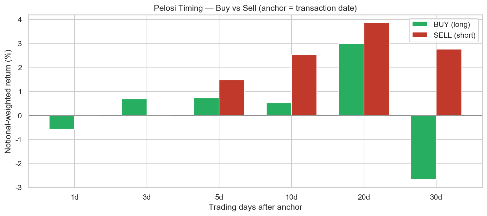
<figcaption>Pelosi timing：买入 vs 卖出 NW 收益对比</figcaption>
</figure>


<figure class="report-fig">
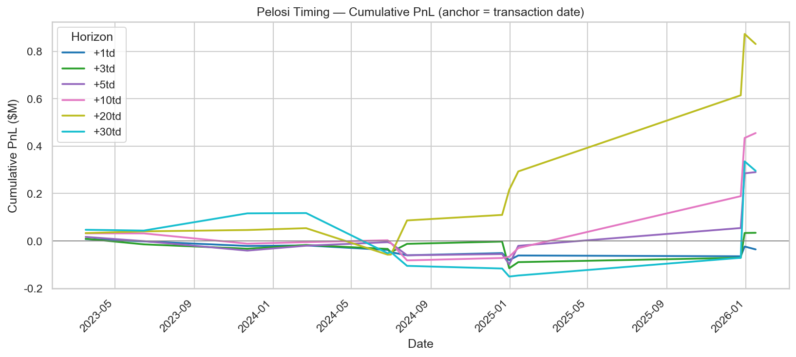
<figcaption>Pelosi timing：累计 PnL（按交易日）</figcaption>
</figure>

### 1d. 已实现收益（FIFO entry → exit）

假设：**entry** = 买入日收盘价，**exit** = 卖出日收盘价；名义 = min(买/卖 `amount_min`)。
未平仓买入按 **mark-to-market** 至 2026-05-30（未实现）。

| 类型 | 配对/笔数 | 名义($) | 总 PnL($) | **NW 收益率** | 中位持仓(天) | 胜率 |
|------|----------:|--------:|----------:|--------------:|-------------:|-----:|
| 已实现（买→卖） | 8 | 5,250,008 | 3,449,448 | **65.70%** | 362 | 100.0% |

- 无对应买入的卖出（`prior_position`）: **3** 笔 — 未计入 realized

明细: `reports/realized_fifo_lots.csv`

## 2. Follow Pelosi（锚点 = **PTR 披露日**）

- 锚点 = **PTR 披露日**；买入=做多跟单，卖出=sign=−1（同 §1 口径）。

### 2a. 合计（买 + 卖）

| 窗口(交易日) | 笔数 | 总名义($) | 总PnL($) | **名义加权收益率** |
|---|---:|---:|---:|---:|
| +1d | 23 | 22,900,023 | -111,228 | **-0.49%** |
| +3d | 23 | 22,900,023 | -284,389 | **-1.24%** |
| +5d | 23 | 22,900,023 | -262,550 | **-1.15%** |
| +10d | 23 | 22,900,023 | -707,851 | **-3.09%** |
| +20d | 23 | 22,900,023 | -6,070 | **-0.03%** |
| +30d | 23 | 22,900,023 | 380,652 | **1.66%** |


<figure class="report-fig">
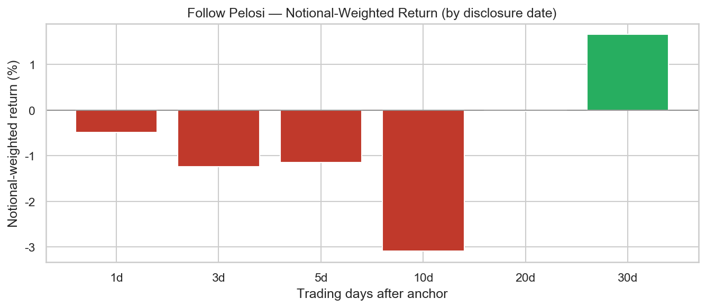
<figcaption>Follow 披露日：名义加权 horizon 收益</figcaption>
</figure>

### 2b. Follow 买（`purchase`）

| 窗口(交易日) | 笔数 | 总名义($) | 总PnL($) | **名义加权收益率** |
|---|---:|---:|---:|---:|
| +1d | 13 | 6,150,013 | 213,232 | **3.47%** |
| +3d | 13 | 6,150,013 | 177,670 | **2.89%** |
| +5d | 13 | 6,150,013 | 116,055 | **1.89%** |
| +10d | 13 | 6,150,013 | 108,123 | **1.76%** |
| +20d | 13 | 6,150,013 | 477,615 | **7.77%** |
| +30d | 13 | 6,150,013 | 342,337 | **5.57%** |

### 2c. Follow 卖（`sale`，sign=−1）

| 窗口(交易日) | 笔数 | 总名义($) | 总PnL($) | **名义加权收益率** |
|---|---:|---:|---:|---:|
| +1d | 10 | 16,750,010 | -324,460 | **-1.94%** |
| +3d | 10 | 16,750,010 | -462,059 | **-2.76%** |
| +5d | 10 | 16,750,010 | -378,605 | **-2.26%** |
| +10d | 10 | 16,750,010 | -815,974 | **-4.87%** |
| +20d | 10 | 16,750,010 | -483,685 | **-2.89%** |
| +30d | 10 | 16,750,010 | 38,315 | **0.23%** |


<figure class="report-fig">
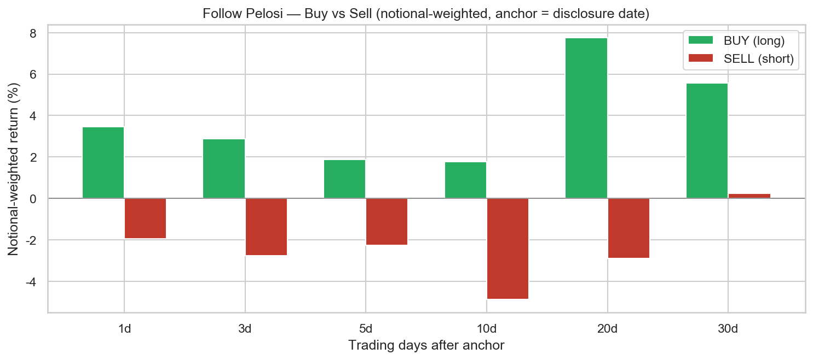
<figcaption>Follow：买入 vs 卖出 NW 收益对比</figcaption>
</figure>


<figure class="report-fig">
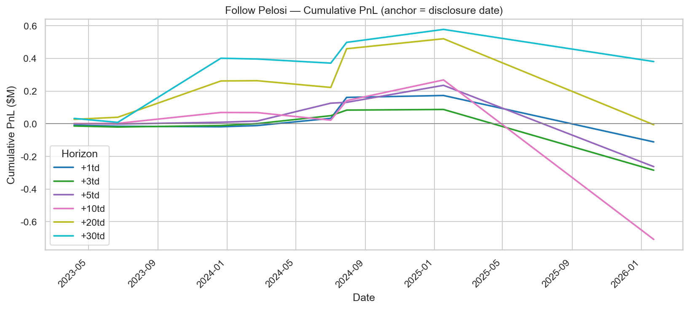
<figcaption>Follow 披露日：累计 PnL</figcaption>
</figure>

## Top Tickers（按 Pelosi 名义金额 `amount_min` 合计）

```
ticker  trades  buys  sales  total_notional  avg_post_5d  avg_post_1d
  AAPL       4     2      2      10750004.0    -0.018763    -0.019277
  NVDA       8     5      3       6500008.0    -0.007662     0.025754
 GOOGL       3     2      1       2000003.0     0.010236     0.005418
  AMZN       2     1      1       1250002.0     0.020686     0.012103
   DIS       1     0      1       1000001.0    -0.016399    -0.002973
  MSFT       1     1      0        500001.0    -0.013718    -0.013806
     V       1     0      1        500001.0     0.019498    -0.002833
  PYPL       1     0      1        250001.0     0.069410     0.000353
  PANW       1     1      0        100001.0     0.071998     0.073345
   TEM       1     1      0         50001.0     0.475391     0.355334
```


<figure class="report-fig">
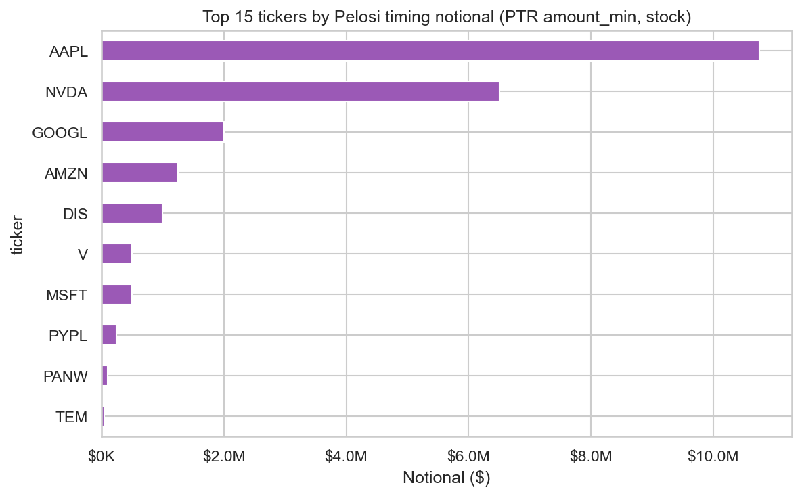
<figcaption>Pelosi 名义金额 Top Ticker（amount_min 合计）</figcaption>
</figure>


## 期权交易分析（House PTR `[OP]`）

- **解析行数**: 14（**7** 个标的）
- **含金额行**: 7 / 17

> **收益口径**：Horizon PnL 用 **标的股票** 价格计算（非期权合约市价）。 **买入/行权 sign=+1**，**卖出 sign=−1**（跟单方向）。 行权 `exercise` 在 FIFO 中视为平仓 long call。

- FIFO 配对: **0** 对，中位持仓 **0** 天
- 明细: `reports/options_raw.csv`, `reports/options_matched_lots.csv`

### O1. 期权 timing（锚点 = 交易发生日，标的价）

#### O1a. 合计（买 + 卖 + 行权；卖/行权按 sign=−1 或 +1 见上）

| 窗口(交易日) | 笔数 | 总名义($) | 总PnL($) | **名义加权收益率** |
|---|---:|---:|---:|---:|
| +1d | 14 | 21,614,632 | 229,740 | **1.06%** |
| +3d | 14 | 21,614,632 | 551,409 | **2.55%** |
| +5d | 14 | 21,614,632 | 551,251 | **2.55%** |
| +10d | 14 | 21,614,632 | 675,473 | **3.13%** |
| +20d | 14 | 21,614,632 | 1,465,165 | **6.78%** |
| +30d | 14 | 21,614,632 | 740,475 | **3.43%** |


<figure class="report-fig">
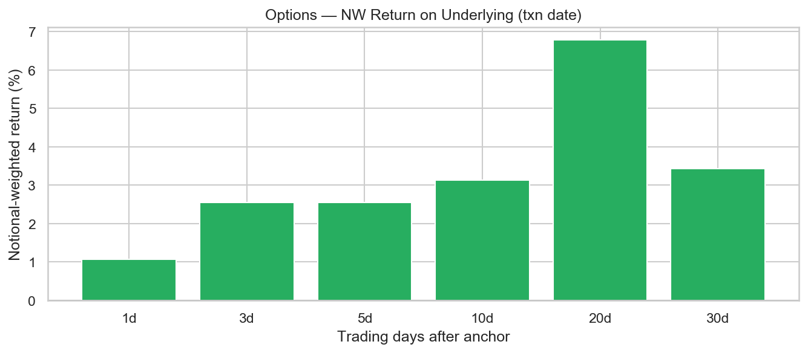
<figcaption>期权：标的价名义加权 horizon 收益（交易发生日）</figcaption>
</figure>

#### O1b. 买入/行权（`purchase` + `exercise`）

| 窗口(交易日) | 笔数 | 总名义($) | 总PnL($) | **名义加权收益率** |
|---|---:|---:|---:|---:|
| +1d | 14 | 21,614,632 | 229,740 | **1.06%** |
| +3d | 14 | 21,614,632 | 551,409 | **2.55%** |
| +5d | 14 | 21,614,632 | 551,251 | **2.55%** |
| +10d | 14 | 21,614,632 | 675,473 | **3.13%** |
| +20d | 14 | 21,614,632 | 1,465,165 | **6.78%** |
| +30d | 14 | 21,614,632 | 740,475 | **3.43%** |

#### O1c. 卖出（`sale`，sign=−1）

（暂无数据）


<figure class="report-fig">
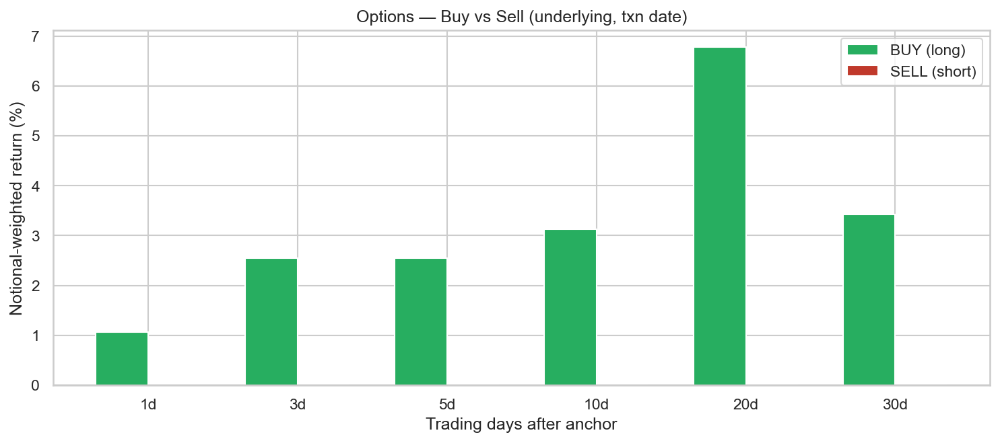
<figcaption>期权：买入 vs 卖出（标的价 NW）</figcaption>
</figure>


<figure class="report-fig">
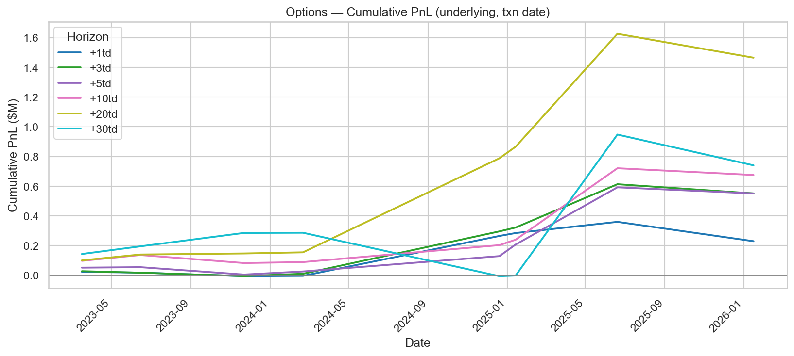
<figcaption>期权：累计 PnL（标的价，交易发生日）</figcaption>
</figure>

### O2. Follow 披露日（标的价）

| 窗口(交易日) | 笔数 | 总名义($) | 总PnL($) | **名义加权收益率** |
|---|---:|---:|---:|---:|
| +1d | 14 | 22,261,170 | 184,092 | **0.83%** |
| +3d | 14 | 22,261,170 | 677,615 | **3.04%** |
| +5d | 14 | 22,261,170 | -688,351 | **-3.09%** |
| +10d | 14 | 22,261,170 | -949,314 | **-4.26%** |
| +20d | 14 | 22,261,170 | 1,342,562 | **6.03%** |
| +30d | 14 | 22,261,170 | -329,876 | **-1.48%** |


<figure class="report-fig">
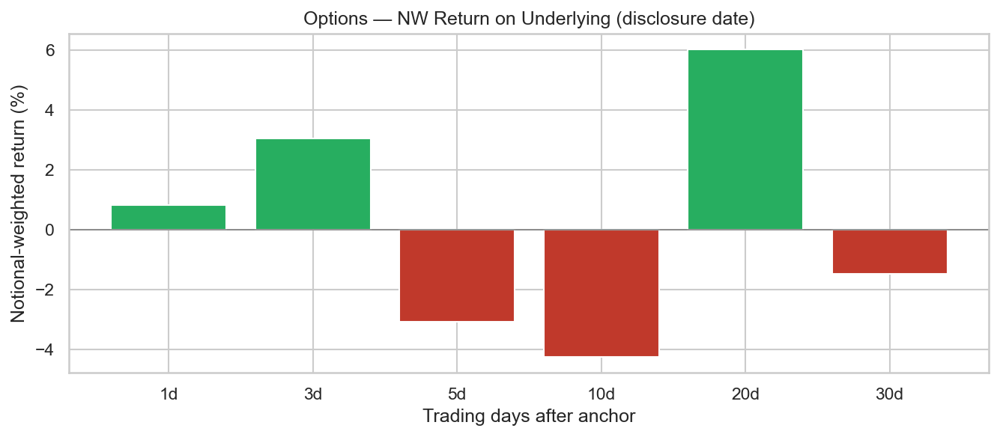
<figcaption>期权：标的价名义加权 horizon 收益（披露日）</figcaption>
</figure>

### 期权合约明细（解析样本）

| 日期 | 动作 | 标的 | 类型 | 行权价 | 到期 | 张数 | 名义下限($) |
|------|------|------|------|-------:|------|-----:|------------:|
| 2023-03-17 | exercise | AAPL | call | 80 | nan | 100 | 500,001 |
| 2023-06-15 | exercise | AAPL | call | 80 | nan | 50 | 250,001 |
| 2023-11-22 | purchase | NVDA | call | 120 | nan | 50 | 1,000,001 |
| 2023-11-22 | purchase | NVDA | call | — | nan | — | 1,000,001 |
| 2024-02-21 | purchase | PANW | call | — | nan | — | 100,001 |
| 2025-01-14 | purchase | AMZN | call | — | nan | — | 250,001 |
| 2025-01-14 | purchase | NVDA | call | — | nan | — | 250,001 |
| 2025-01-14 | purchase | TEM | call | — | nan | — | 50,001 |
| 2024-12-20 | exercise | NVDA | call | 12 | nan | 500 | — |
| 2024-12-20 | exercise | PANW | call | 100 | nan | 140 | — |
| 2025-06-20 | exercise | AVGO | call | 80 | nan | 200 | — |
| 2026-01-16 | exercise | AMZN | call | 150 | nan | 50 | — |
| 2026-01-16 | exercise | NVDA | call | 80 | nan | 50 | — |
| 2026-01-16 | exercise | VST | call | 50 | nan | 50 | — |

### 与股票组合的关系

- 典型模式：**买入 call（[OP] P）** → 标的上涨 → **行权（exercise）** 或 **卖 call / 卖股** 兑现。
- 请对照上文 **股票 §1d FIFO** 与同期期权表，检查是否在同一披露窗口内出现「期权开仓 + 股票卖出」。


## 说明

- 数据来源为 **House Clerk STOCK Act PTR**（`disclosures-clerk.house.gov`），非总统 OGE Form 278-T。
- 名义金额 = PTR 披露区间**下限**相加，非精确成交价；单笔可能落在 $1,001–$15,000 至 $50M+ 等 bracket。
- 主收益表默认 **有 `amount_min` 的笔数**；与「有 ticker」笔数可能不同（OCR 仅 ticker 行已尝试从同 filing 回填金额）。
- 三套名义 / 两套 FIFO 对照见文首 **「名义与口径」**；合并价表已按 ticker 并集日期（修复短窗口覆盖长窗口）。
- `return_post_disclosure_20d` 在披露日距数据截止不足 20 交易日时为空。

完整数据: `reports/trades_analysis.csv`
